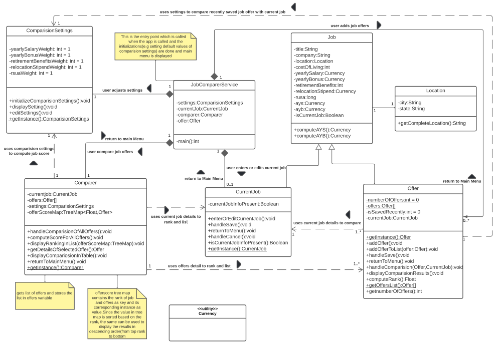
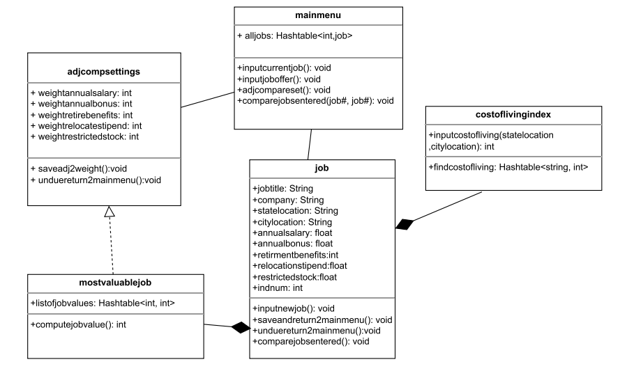
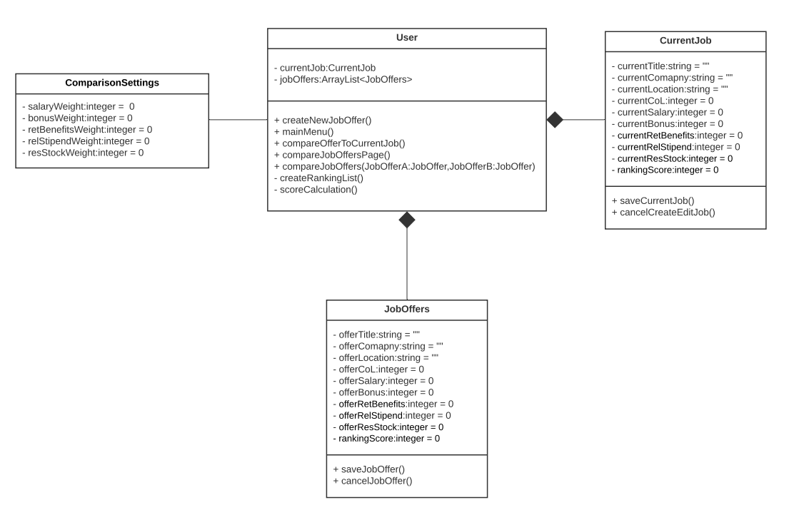
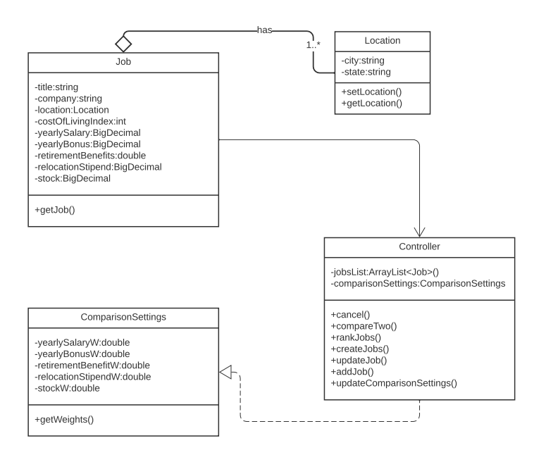
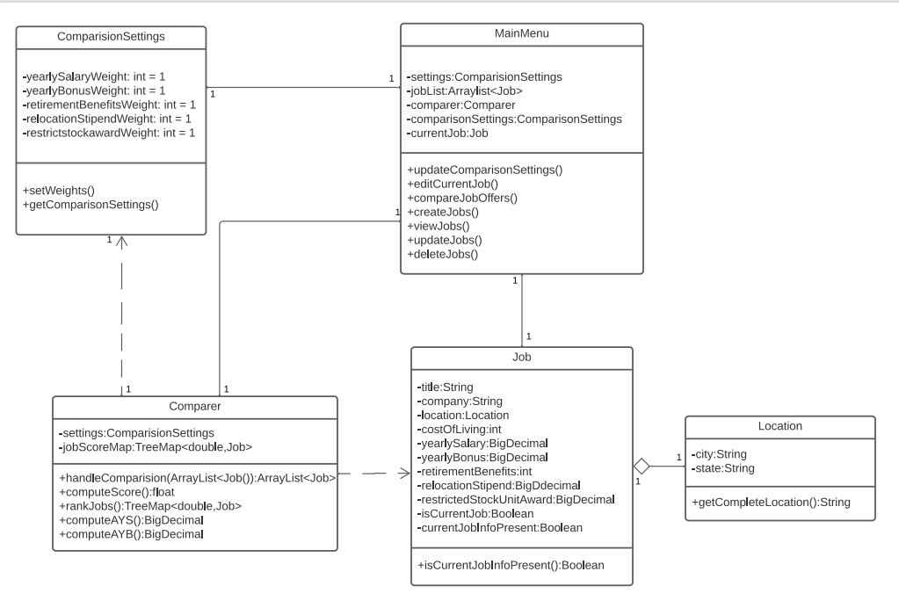

# Design Discussion

## Individual Designs

### **Design 1 (Nivethi)**

***Pros:***
* The design has high cohesion and low coupling. 
* Strongly related attributes are placed together in a class and there is less dependency between classes which makes it easier to remodel the design in case the requirements change in future.
* The design has good readability since the association between the classes are captured above the relationship line.
* All the requirements stated in the assignment are addressed by this design.
* Suitable access specifiers, default values, return types, multiplicities, relationships are used in this design.
* The design has a proper entry point that initializes other classes, sets default values, and connects all other classes which makes the logic flow much clearer.

***Cons:***
* Too many details and arrow marks made the design over the relationship lines over complicated the design though the requirements were simple
* Some purely GUI related functions are present. But as per the assignment instruction, they need not be captured in the design diagram.
* The function handleComparision() in Offer class is redundant and comparison can be handled In Comparer class.
* The CurrentJob and Offer class can be merged into one class since both the classes share common attributes.
* The Currency utility class can be removed and replaced with BigDecimal.

### Design 2 (Michael)

***Pros:*** 
* breaks up location into state and city and compares to cost of living index
* Has functions for saving and cancelling changes to comparison settings & job entries
* Has table of job values based on computation
* simple and informative design

***Cons:***
* Missing function to rank jobs in mainmenu class
* Missing some relationships
* Missing job array list in mainmenu class
* No method to calculate RSUA

### Design 3 (Janet)

***Pros:*** 
* Simple design
* Has basic CRUD methods for the classes
* Has requirements for the JobOffers/CurrentJob classes

***Cons:***
* The CurrentJob and JobOffer classes can be merged into one class
* Missing some classes
* Missing some relationships
* No need for User class

### **Design 4 (Mai)**

***Pros:***
* Clean and easy to follow
* Has requirements for job class
* Has method to update and create jobs 
* Researched proper data type for money

***Cons:***
* Missing adjusted salary and bonus
* No method to calculate RSUA
* Relationships details are not consistent. Location and job has a relationship detail and ratio but not the rest
* Missing methods read (viewJobs) and delete job (CRUD)

## **Team Design**

***Commonalities & Differences***

Similar to design 4, the team design has the ability to update and create jobs. To meet the requirements, we added methods to view and delete jobs and put them into a MainMenu class.
Design 4 and team design both uses BigDecimal as the currency data type
All designs have a compareSettings class

Design 1 and 4 have a location object.  Most of the attributes used in classes are common between Team Design and Design 1
All the required functions for rank computation are placed in Comparer whereas in Design 1 it was spread between Comparer, Offer and Job class.
Design 1 has a static getInstance() function in all classes but in TeamDesign the getInstance() function is removed.
Some relationships have been modified between Design 1 and Team Design.

**Summary**

Our team met for the first time on Wednesday 6:30 EST/5:30 CST. We went through each design and discussed the pros and cons of each design. There were many debates on which would be the best relationships between the classes and what attributes and methods were needed to meet the requirements of the assignment without including the view aspect of the requirements. After the meeting, we were connected through Slack and made major decisions regarding Team Design . In this process we all received positive and negative feedback from each other and created a design that is inclusive of all our designs and that satisfies the assignment requirement.  We used Design 1 as our base and added all the pros from all of our designs into the team design. We then discussed the cons of design 1 and made changes to the diagram and replaced the cons with the pros from the other designs. All the team members were added as collaborators to our Team Design in Lucid chart and thus everyone worked on the design concurrently and in short span of time we completed our Team Design.
