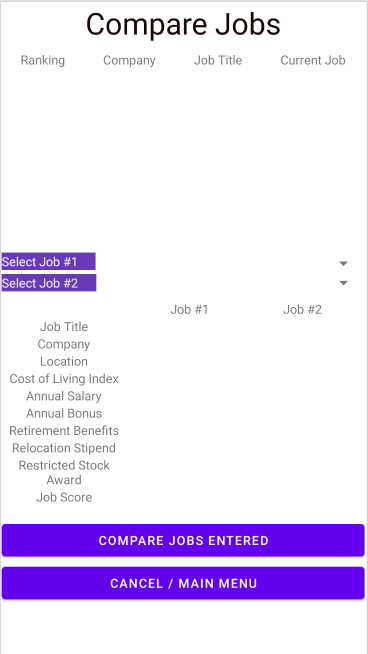

# Design Document

**Author**: Mai Truong and Michael Rojas

## 1 Design Considerations

### 1.1 Assumptions

The design must be user-friendly and meet the requirements of a job comparison Android application that can compare jobs beyond just the salary. It must include the different aspects of the job offer such as a yearly bonus and a relocation stipend and how it compares to other job offers based on location. The weight of each benefit of a job offer may also differ depending on the user. The application is flexible and lets the user customize the weights and what they look for when finding the best job offer.

### 1.2 Constraints

The constraint of the design is that there is no login or multiple users at this time. The user cannot share any information or interact with other users. The application is simple and does not include a database.

### 1.3 System Environment

The software assumes that the user is on an android device running Android 10.0 Q.

## 2 Architectural Design

### 2.1 Component Diagram

### 2.2 Deployment Diagram

A deployment diagram will not be needed for this design. The design is a single-system application that will only be on one device, an android device. There will not be any external servers or databases for this design.

## 3 Low-Level Design

In the Job Comparison <<UI>> components, there are multiple view classes. In 3.2 Other Diagrams, there is a sequence diagram that shows the flow between the Job Comparison UI component vs. the other back end components. The Job Comparison component includes a Main Menu view, CurrentJobView, AddJobView, ComparisonSetting View and a CompareView. The user can access all the other views from the MainMenu view. Users can add in job details, their current job, comparison settings weight and select jobs they want to compare. It then passes this information to the JobService class and the JobService class will send back the information the view needs. More information about the interaction between the backend components are shown in the Class Diagram and Sequence Diagram.

### 3.1 Class Diagram

### 3.2 Other Diagrams
Sequence Diagram

## 4 User Interface Design

### 4.1 Main Menu

### 4.2 Enter Current Job Interface

### 4.3 Enter New Offer Interface

### 4.4 Adjust Comparison Settings Interface

### 4.5 Compare Jobs Interface

