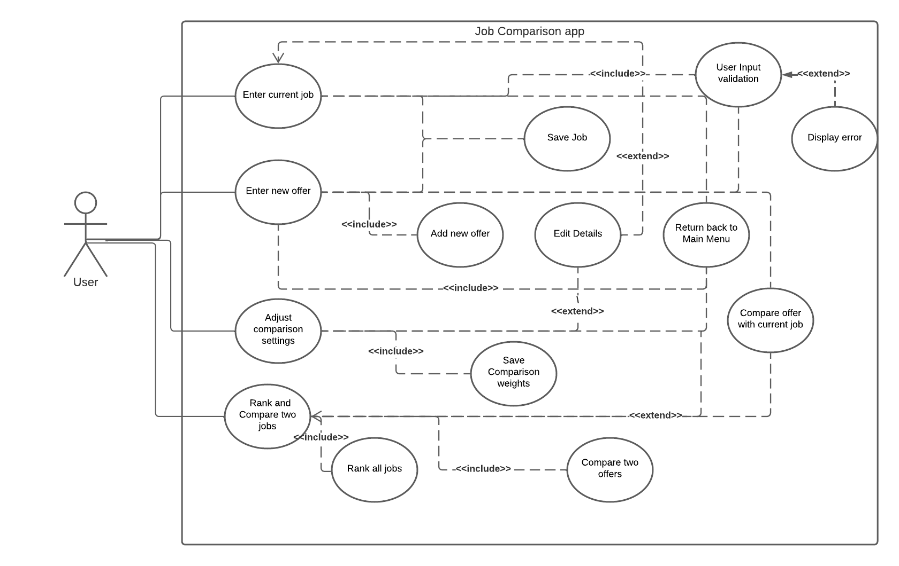
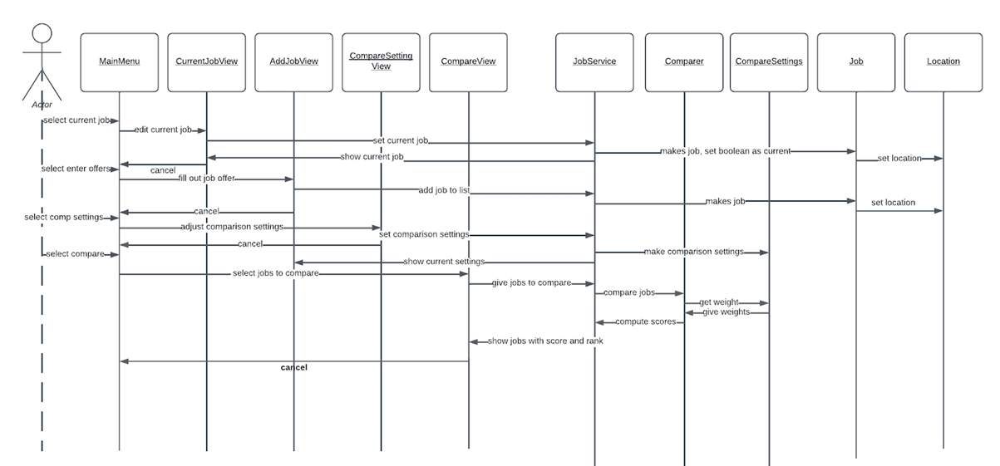

# Use Case Model

## 1 Use Case Diagram

## 2 Use Case Descriptions

### 2.1 Requirements

> 1. Enter Current Job Details: must allow the user to enter the title, company, location, cost of living, salary, bonus, benefits, stipend, and stock unit. It also permit the user to edit the current job details saved already

> 2. Enter job offer: must allow the user to enter and save multiple job offers. The user can also compare the saved offer with current job.

> 3. Adjust Comparison Settings: allow the user to modify the comparison settings. The yearly salary, yearly bonus, relocation stipend, and restricted stock unit awards are given weights. The user will be allowed to modify the weights of each.

> 4. Compare Job Offers: Rank and display all the jobs based on their score. Allow the user to select two job offers and compare the two selected jobs.

### 2.2 Pre-conditions

> 1. Enter Current Job Details: the user must have values to enter in for the job details. None of the fields must be null. The title, company, location fields accept string input and yearly bonus, salary, relocation stipend,cost of living, retirement benefit,restricted stock fields accept unsigned numeric value.

> 2. Enter Job Offer: The user must have an active current job in order to compare with the recent job offer.The title, company, location fields accept string input and yearly bonus, salary, relocation stipend,cost of living, retirement benefit,restricted stock fields accept unsigned numeric value. To compare with the current job, the job offer must be saved and the user must have already entered current job details.

> 3. Adjust Comparison Settings: The user must have weights to enter in the comparison settings page. The weights can be any unsigned non numeric value greater than or equal to 1. Also the system does not permit the user to enter 0 for all weights . By default all the weights are initialized to 1 when the system comes up.

> 4. Compare Job Offers: The system ranks the jobs if there are at least details of two jobs in the system. The user must select two jobs to see comparison results. 

### 2.3 Post-conditions

> 1. Enter Current Job Details: the user now has saved current job with the set details they provided.When the user chooses the same option again, the page opens with the current job details saved earlier.

> 2. Enter job offer: Multiple job offer information can be entered in the system. The user can compare the new offer with the current job to get a clear understanding of the difference.

> 3. Adjust Comparison Settings: The weights of the yearly salary, yearly bonus, relocation stipend, and restricted stock unit awards are modified and saved to the adjusted values by the user. This can influence the score computation for the jobs.

> 4. Compare Job Offers: The user gets a clear picture of all the jobs based on the ranking. The user is provided a display that compares the two jobs that the user selected from the ranked job offers.

### 2.4 Scenarios

> 1. Enter current job details

> Normal Scenario

>> 1. The user selects the ‘Enter current job’ option from the main menu.

>> 2. The user enters all the details in the correct format.

>> 3. The user hits Save which saves the details and takes the user back to the main menu.

> Alternate Scenario

>> 1. The user selects the ‘Enter current job’ option from the main menu.

>> 2. The user enters all the details.

>> 3. The user hits cancel and thus the details entered are not saved.

> Exceptional Scenario

>> 1. The user selects the ‘Enter current job’ option from the main menu.

>> 2. The user leaves some fields empty or fills values of the wrong type.

>> 3. The GUI throws an error because of which the user cannot save data.

>> 4. The user corrects the error and enters correct details. Thus correct details are entered in the system.

> 2. Enter Job Offer

> Normal Scenario

>> 1. The user selects the ‘Enter job offer’ option from the main menu.

>> 2. The user enters all the details in the correct format.

>> 3. The user hits Save which saves the details and hits compare with current job.

>> 4. The user clicks ‘Add new offer’ in the comparison page to add a new job offer or click the main menu to go back to the main page.

>> 5. The user hits Add new offer to enter new offer details in the system.

> Alternate Scenario

>> 1. The user selects the ‘Enter job offer’ option from the main menu.

>> 2. The user enters all the details.

>> 3. The user hits cancel and thus the details entered are not saved.

> Alternate Scenario

>> 1. The user selects the ‘Enter job offer’ option from the main menu.

>> 2. The user enters all the details.

>> 3. The user hits save and then hits ‘Return to main menu’ that takes the user back to the main menu.

> Exceptional Scenario

>> 1. The user selects the ‘Enter job offer’ option from the main menu.

>> 2. The user leaves some fields empty or fills values of the wrong type.

>> 3. The GUI throws an error because of which the user cannot save data.

>> 4. The user corrects the error and enters correct details. Thus correct details are entered in the system.

> Exceptional Scenario

>> 1. The user selects the ‘Enter job offer’ option from the main menu.

>> 2. The user enters all the details.

>> 3. The Compare button is still disabled since the user has not saved the offer or the current job detail is not entered by the user.

> 3. Adjust Comparison Settings

> Normal Scenario

>> 1. The user selects the ‘Adjust comparison Settings’ option from the main menu.

>> 2. The user enters all the details in the correct format.

>> 3. The user hits Save which saves the details and takes the user back to the main menu.

> Alternate Scenario

>> 1. The user selects the Adjust comparison Settings’ option from the main menu.

>> 2. The user enters all the details.

>> 3. The user hits cancel and thus the details entered are not saved.

> Exceptional Scenario

>> 1. The user selects the Adjust comparison Settings’ option from the main menu.

>> 2. The user leaves some fields empty or fills values of the wrong type.

>> 3. The GUI throws an error because of which the user cannot save data.

>> 4. The user corrects the error and enters correct details. Thus correct details are entered in the system.

> Exceptional Scenario

>> 1. The user selects the Adjust comparison Settings’ option from the main menu.

>> 2. The user enters all zeros for the weights

>> 3. The GUI throws an error that all the weights cannot be zero.

>> 4. The user corrects the error and enters correct details. Thus correct details are entered in the system.

> 4. Compare Job Offers

> Normal Scenario

>> 1. The user selects the ‘Compare Job Offers’ option from the main menu.

>> 2. The user can view the ranking of all his jobs

>> 3. The user selects 2 jobs to compare and hits the Compare button to check the comparison results.

>> 4. The user can then trigger another comparison or return to the main menu.

> Alternate Scenario

>> 1. The user selects the ‘Compare Job Offers’ option from the main menu.

>> 2. The user can view the ranking of all his jobs

>> 3. The user hits Cancel and returns back to the main menu.

> Exceptional Scenario

>> 1. The Compare job offers button is disabled since the user has not yet added two jobs to the system.

>> 2. The user adds two jobs to the system.

>> 3. The user can now hit ‘Compare Job Offers’ option.

### 2.5 Scenarios

Sequence Diagram to express the sequence of events that characterize the use case: 

