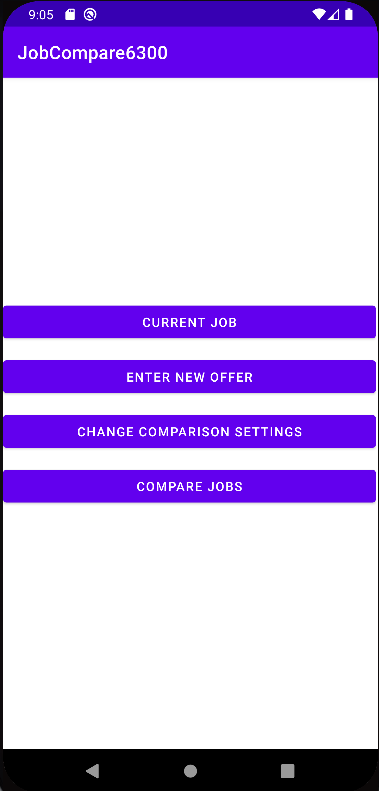
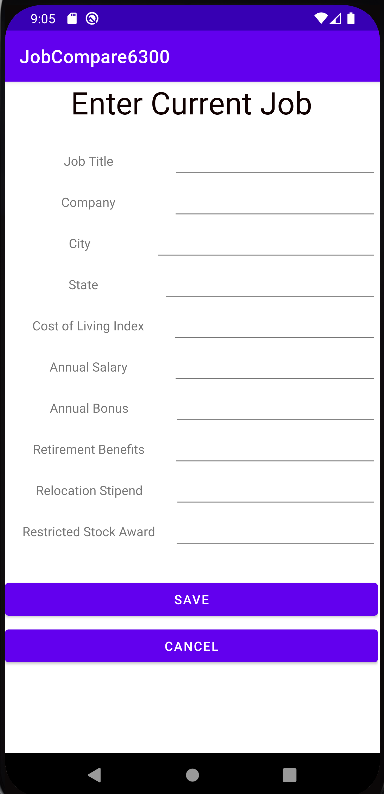
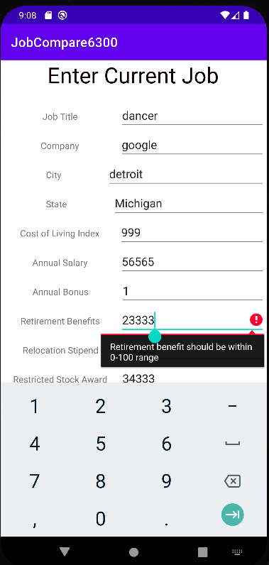
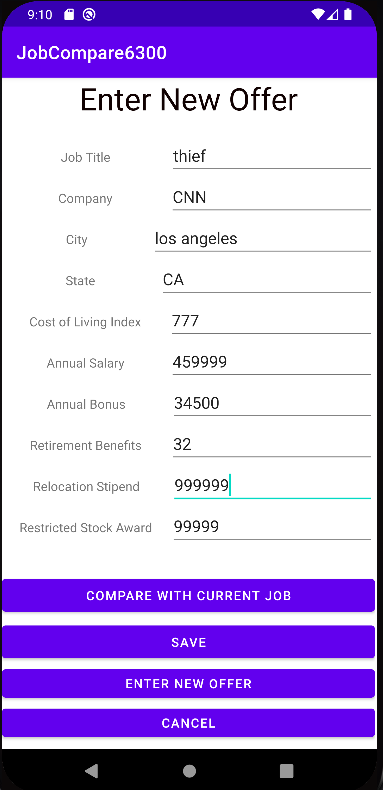
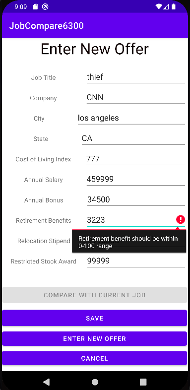
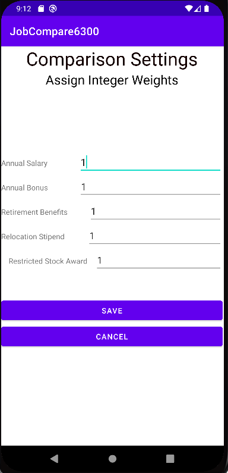
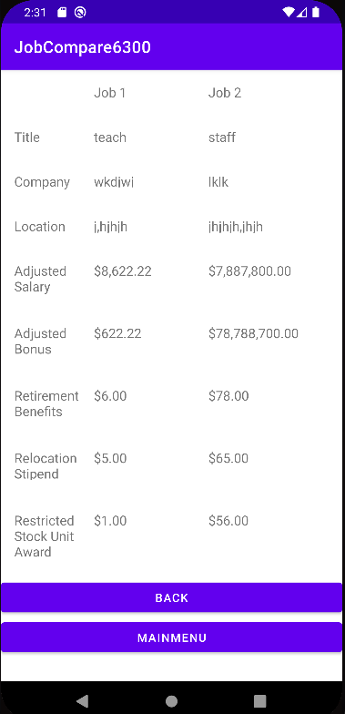

# Design Document

**Author**: Michael Rojas

## 1 User Manual

### 1.1 Overview

The JobComparer6300 application is designed for Android devices which allows a user to compare job offers for the purpose of making the most fiscally sound decision. This applications functions by ranking the jobs entered by the user according to calculated economic value; This calculation is based on a complex asessment of the cost of living (physical location of the job), annual salary, annual bonus, retirment benefits, relocation stipend, and restricted stock award offered by each position. 
 
### 1.2 Main Menu

The application opens up to the Main Menu page; this page contains four individual buttons that redirect to four separate pages that allow the user to enter their current job, new job offers, change the comparison settings, and compare jobs, respectively.  

### 1.3 Enter Current Job

The Enter Current Job page allow the user to enter the job title, company name, location (city and state), cost of living index (where the job is located), annual salary, annual bonus, retirment benefits, relocation stipend, and restricted stock award for their current job.  This page has two buttons which allow the user to save their entry (saved to local database) and cancel (return to the main menu) the entry process. 

This page will show errors and prevent saving if the user inputs an invalid entry.

### 1.4 Enter New Offer

The Enter New Offer page allows the user to enter the job title, company name, location (city and state), cost of living index (where the job is located), annual salary, annual bonus, retirment benefits, relocation stipend, and restricted stock award for their current job.  This page has four buttons which allow the user to compare a new saved offer to their current job, save their entry (saved to local database), enter a new offer, and cancel (return to the main menu) the entry process, respectively. The compare with current job button will not function until the has saved a valid current and new job entry.

This page will show errors and prevent saving & comparing to current job if the user inputs an invalid entry.

### 1.5 Comparison Settings

The Comparison Settings page allows the user to adjust the weight attributed to annual salary, annual bonus, retirement benefits, relocation stipend, and restricted stock award used for the calculation of economic value for any valid job entry. This page has two buttons that allow the user to save adjustments to the comparison settings (saved to local database) and cancel (return to the main menu) the entry process, respectively.    

### 1.6 Compare Jobs

The Compare Jobs page allows the user to see a table containing the rank (based on calculated economic value), company name, job title, score (calculated economic value), and current job status for each saved entry (this data is pulled from a database).  

The user can select two jobs, by tapping individual rows (tabs are highlighted if selected), for a detailed comparison: only two rows can be selected at a given time.  This page has two buttons that allow the user to compare the two jobs selected (only two jobs can be selected) and cancel (return to the main menu), respectively.  The compare button only works if at leat two jobs are selected. 

Once the user hits the compare button, they are redirected to a page showing the the title, company name, location (city and state), cost of living index (where the job is located), annual salary, annual bonus, retirment benefits, relocation stipend, and restricted stock award for two jobs selected.  This page has a back (return to previous screen) and main menu button (return to the main menu), respectively.

